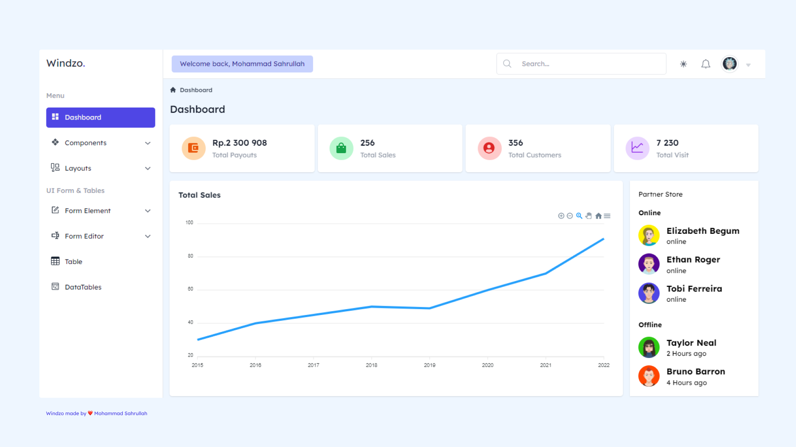
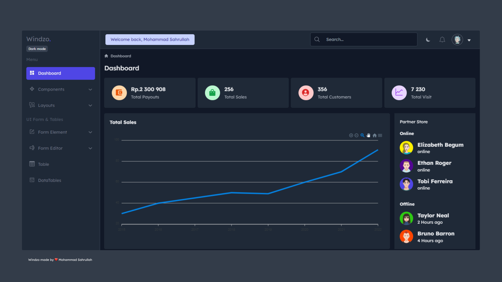

<h1 align="center">Supervest</h1>
<p align="center">easy to use platform to make long-term investing in crypto simpler | built for ETHGlobal HackMoney 2022 Hackathon</p>

### Preview




## Live Demo

Click here to <a href="https://supervest-ve392a.argoapp.io/">Live Demo.</a>.
This runs on mainnet and is not fully tested so please be careful with your transactions. 

## Description

Supervest is a platform designed to encourage investment in crypto by slowly streaming an amount per month that the user is willing to invest.

The idea came from the recently volatile markets and the large losses that many endured. We are still in the early stages of blockchain and investing now will most likely prove worthwhile in the future. However due to volatility many are discouraged from doing so. Supervest acts similar to a 401K where every set amount of time your money, in USDC in this case, is converted to the crypto you want to invest in. You can set how much per month you want to invest in a token. Currently only investing in MATIC is supported.

## How it works

First you connect to the dapp using the web3modal which allows for Metamask, Coinbase Wallet, and WalletConnect. 

Then you can fund your wallet using Transak integration.

In the main dashboard you can see how many streams you have along with the price of MATIC obtained through the Redstone API.

In the streams dashboard you can create, update, and delete existing streams. Currently only the Polygon Mainnet is supported and transfers from USDC -> Polygon. Be careful using this as it was not properly tested due to time constraints.

Streams are created using Superfluid Supertokens. Unfortunately, Superfluid only allows streaming per second to a wallet and not swapping. Thus once a stream is created, the USDC is streamed to a middle-man wallet which will perform the swap every X amount of seconds using the Uniswap v3 SDK. Then the wallet transfers the swapped amount back to the user connected wallet using ethers.js.

I was able to get all of those mechanics working on mumbai mainnet, but unfortunately was sometimes receiving errors on polygon mainnet regarding gas fees and transaction underpriced errors.

## Future Work

- Correct the bugs in the platform for correct streaming + swapping on every second
- More research is needed on the fees and gas prices to better understand a good model for swapping continuously.
- A database to have the dashboard be persistent
- Streaming into LP (lending pool) positions or streaming into staking positions
- Have dashboard display list of user tokens and how much they have earned with the platform

## Bounties
- Polygon: dapp uses Polygon mainnet for running transactions
- WalletConnect: sign-on through web3modal
- Coinbase: sign-on through web3modal
- Superfluid: creates streams so user can invest their money over time
- Redstone: gets MATIC data and populates chart
- Spheron: hosts site
- IPFS/Filecoin: Spheron running on IPFS/Filecoin
- Uniswap: swap coin over time to send the crypto back to user

## Installation

<p>1. clone this repo first or download zip code </p>

```
git clone https://github.com/sgarcia22/supervest
```

<p>2. Open supervest folder and follow the step </p>

## Step to run this app

## 1. Project setup

<p>before use,  install all dependencies app first with command :</p>

using npm :

```
npm install
```

using yarn :

```
yarn install
```

### 2. Compiles and hot-reloads for development

<p>run this command to compile code :</p>

using npm :

```
npm run serve
```

using yarn :

```
yarn serve
```

### 3. Compiles and minifies for production

<p>build your app project to production with command :</p>

using npm :

```
npm run build
```

using yarn :

```
yarn build
```


## Author

Superbest is created by <a href="https://samgarcia.xyz">Sam Garcia.</a>